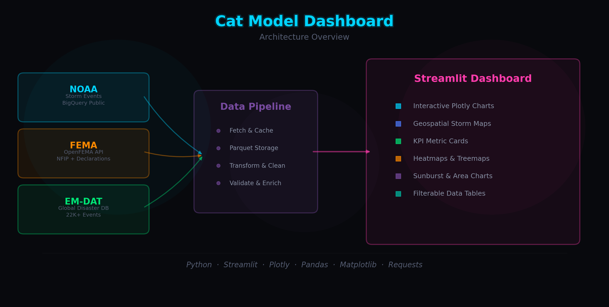
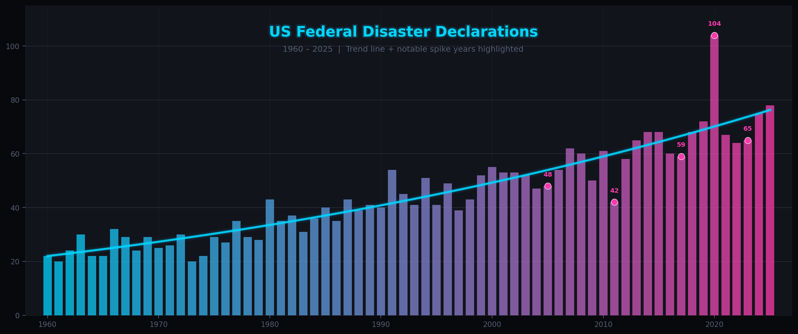
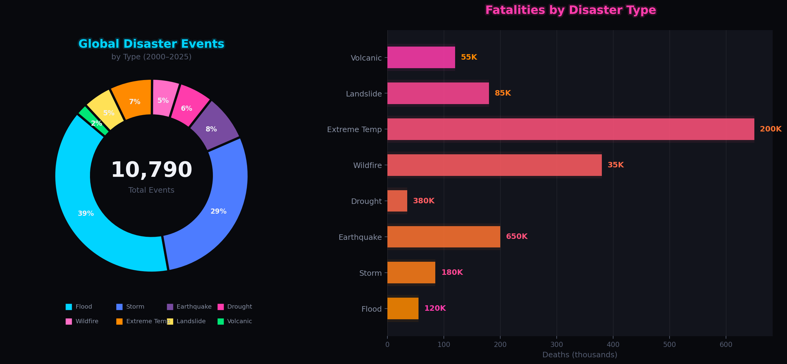
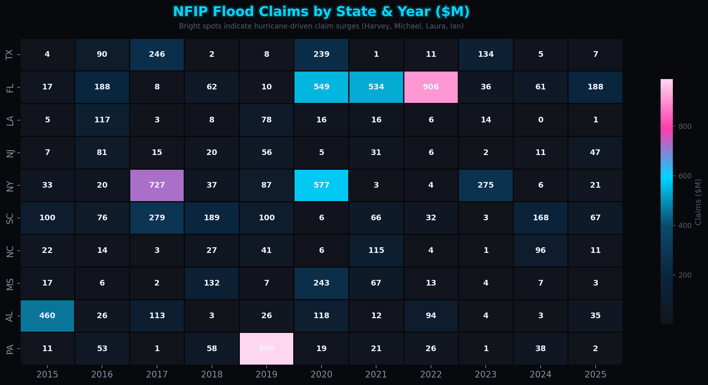
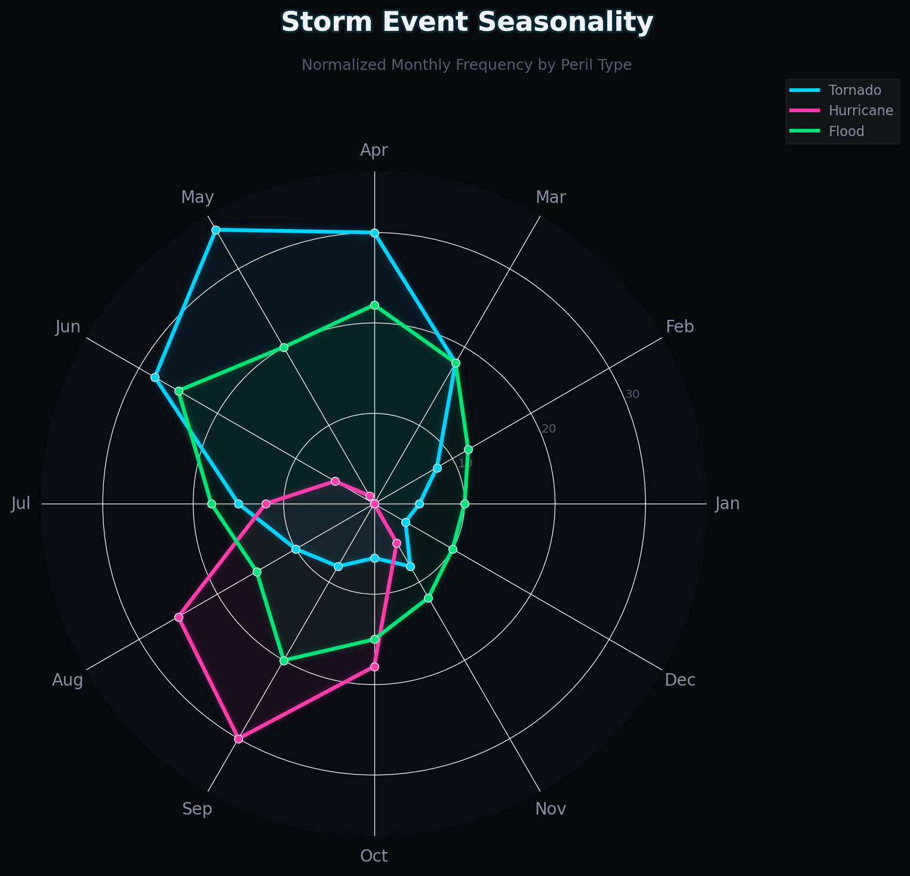
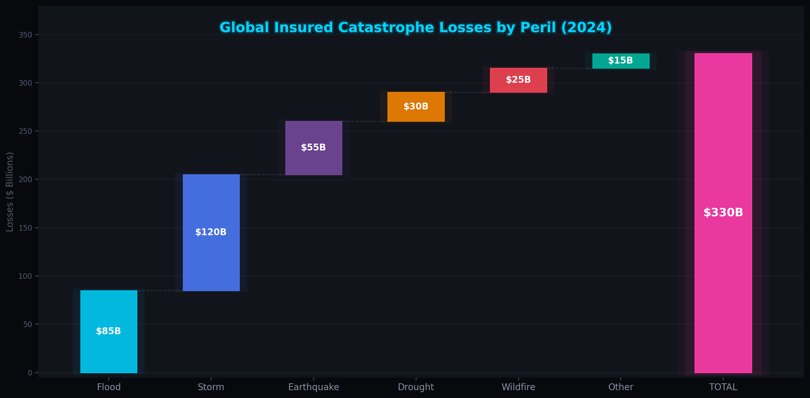
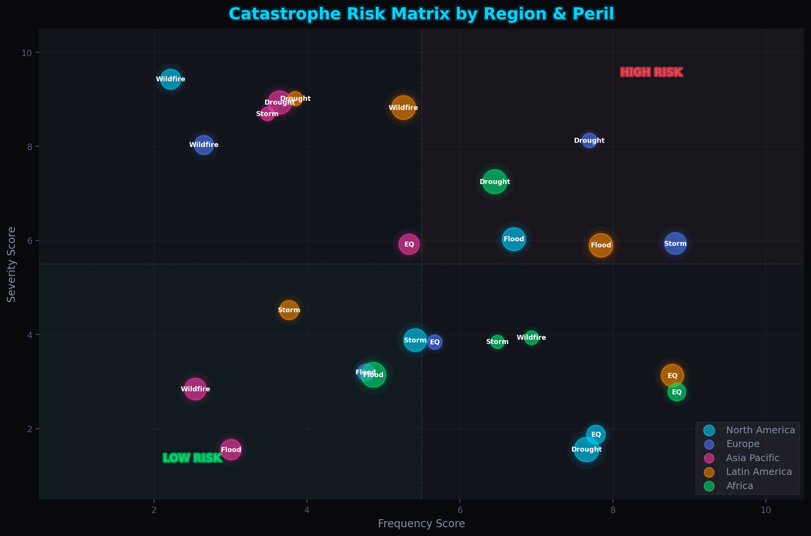

# Cat Model Dashboard

**Catastrophe Modeling Analytics Platform** — An interactive multi-source dashboard for catastrophe risk analysis, combining US federal disaster data with global disaster intelligence.



---

## Overview

The Cat Model Dashboard aggregates and visualizes catastrophe data from three authoritative sources to support risk assessment, exposure analysis, and loss estimation workflows:

| Source | Coverage | Data |
|--------|----------|------|
| **FEMA OpenFEMA** | United States | Disaster declarations, NFIP flood claims |
| **NOAA Storm Events** | United States | Severe storm location, azimuth, impact, damage |
| **EM-DAT / CRED** | Global (190+ countries) | 22,000+ mass disasters since 1900 |

---

## Dashboard Views

### US Disaster Declarations Trend

Historical federal disaster and emergency declarations across the United States, showing the accelerating frequency of catastrophic events.



### Global Disaster Breakdown (EM-DAT)

Distribution of natural disasters by type worldwide, with associated fatalities — sourced from UN agencies, insurers, and research institutes.



### NFIP Flood Claims Analysis

National Flood Insurance Program claims data including building and contents damage, analyzed by state, year, and flood zone.



### Storm Event Seasonality

NOAA severe storm events analyzed by month to reveal seasonal patterns across tornado, hurricane, and flood perils.



### Economic Loss Waterfall

Global insured catastrophe losses decomposed by peril type, showing the contribution of each hazard to total industry losses.



### Regional Risk Matrix

Multi-peril risk assessment across global regions, plotting event frequency against severity to identify concentration risk.



---

## Data Sources

### NOAA Severe Storm Events Database
NOAA's Storm Events Database contains records of storms and significant weather phenomena with location, azimuth, impact, and damage data. Available through [NOAA NCEI](https://www.ncdc.noaa.gov/stormevents/) and [Google BigQuery public datasets](https://console.cloud.google.com/marketplace/product/noaa-public/severe-storm-events).

### EM-DAT International Disaster Database
The [EM-DAT database](https://www.emdat.be/) maintained by the Centre for Research on the Epidemiology of Disasters (CRED) contains core data on over 22,000 mass disasters worldwide from 1900 to present, compiled from UN agencies, non-governmental organizations, insurers, research institutions, and press agencies.

### FEMA OpenFEMA
[OpenFEMA](https://www.fema.gov/about/openfema) provides public access to FEMA data including:
- **Disaster Declarations Summaries** — Federal disaster and emergency declarations
- **FIMA NFIP Claims** — National Flood Insurance Program claims with building/contents damage, flood zones, and payout data

---

## Installation

```bash
# Clone the repository
git clone https://github.com/SalvatoreIngenito/cat-model-dashboard.git
cd cat-model-dashboard

# Install dependencies
pip install -r requirements.txt

# Run the dashboard
streamlit run app.py
```

## Project Structure

```
cat-model-dashboard/
├── app.py                  # Main Streamlit dashboard application
├── requirements.txt        # Python dependencies
├── generate_images.py      # Static chart image generator
├── src/
│   ├── __init__.py
│   └── data_fetcher.py     # Data fetching & caching (FEMA, NOAA, EM-DAT)
├── data/                   # Cached parquet files (auto-generated)
└── images/                 # Dashboard preview images
    ├── architecture_diagram.png
    ├── disaster_declarations_trend.png
    ├── global_disaster_types.png
    ├── nfip_claims_heatmap.png
    ├── storm_seasonality_radar.png
    ├── economic_losses_waterfall.png
    └── regional_risk_matrix.png
```

## Tech Stack

- **Python 3.9+**
- **Streamlit** — Interactive web dashboard
- **Plotly** — Interactive charts, maps, treemaps, and heatmaps
- **Pandas** — Data manipulation and analysis
- **Matplotlib / Seaborn** — Static chart generation
- **Requests** — API data fetching from OpenFEMA and NOAA

## Features

- **Multi-source data integration** — FEMA, NOAA, and EM-DAT in a unified view
- **Interactive filtering** — Filter by year, state, incident type, region, and disaster type
- **Geospatial mapping** — OpenStreetMap-based storm event visualization
- **KPI dashboards** — Key risk indicators with real-time aggregation
- **Data caching** — Parquet-based caching for fast subsequent loads
- **Responsive design** — Wide-layout dashboard optimized for analysis workflows

## License

MIT
